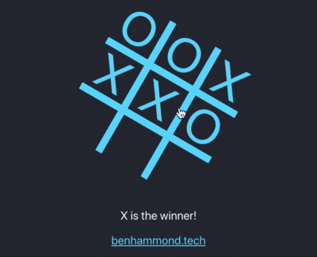

# React Tac Toe

### Learning React by Building and Styling the Classic Game

> [Play React-Tac-Toe](https://react-tac-toe.netlify.app/)

## Background

Decided to practice my React skills by recreating the classic tic-tac-toe; ended up with a goofy yet compelling little game.

## Tech

- **React:** functional components, `useEffect()` and `useState()` hooks
- **CSS Grid:** the game board lines are actually the gaps between grid items
- **CSS Animation / Rotate:** already present for `create-react-app` logo; applied to entire game-board

## Problems Solves

- Fixed up the win- and tie-condition issues I'd been having by using state to store current player's turn info, to keep track of the number of total pieces played, and presence of a winner.
- Corrected the timing of displaying winner info AFTER winning piece is displayed by incorporating useEffect() and treating DOM manipulation as a side effect of the winner calculation
- Deployed to Netlify, straightforward using their GitHub integration for CI/CD.

## Style

For a bit of whimsy I ultimately decided to style the entire board like the default `create-react-app` logo, so that the game actually spins in glowing aqua-blue as you play. Not only did I think it was funny and kinda cool; in all honesty it brings a level of drama to tic-tac-toe gameplay that I haven't experienced in since I was 7 years old.

## Blog Post

Read more at [blog.benhammond.tech](https://blog.benhammond.tech/react-tac-toe)

## Play the Game

[Play React-Tac-Toe](https://react-tac-toe.netlify.app/)
